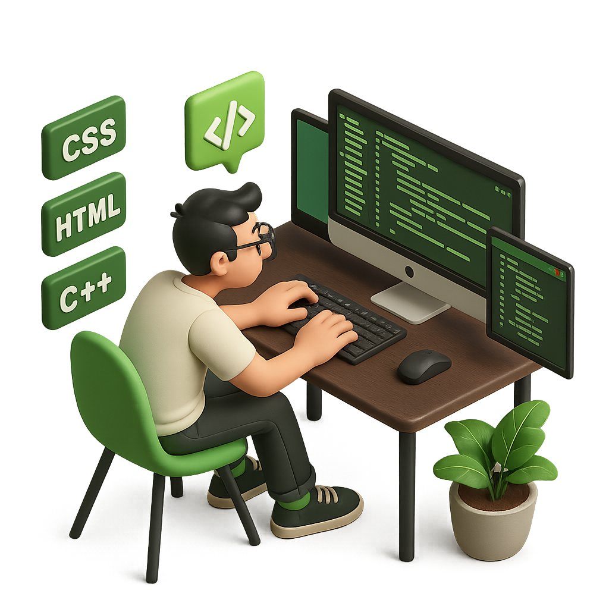
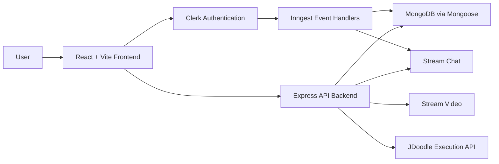
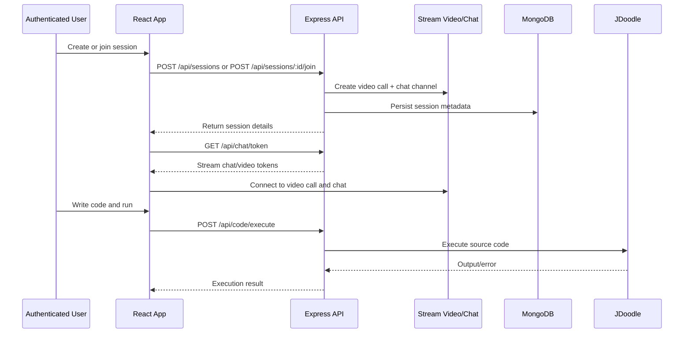

# 🎯 Interview Platform

<div id="top"></div>

<div align="center">
  
</div>

<div align="center">

A **full-stack collaborative coding interview platform** built for real-time technical sessions, live problem solving, and pair-programming style practice.

[Live Demo](https://interview-platform-peex.onrender.com) • [Report Bug](../../issues) • [Request Feature](../../issues)

</div>

<div align="center">

[](https://github.com/rudra2609-06/Interview-Platform/stargazers)
[](https://github.com/rudra2609-06/Interview-Platform/network/members)
[](https://github.com/rudra2609-06/Interview-Platform/issues)
[](https://github.com/rudra2609-06/Interview-Platform/blob/main/LICENSE)

</div>

---

## 📋 Table of Contents

- [🎯 Overview](#-overview)
- [✨ Features](#-features)
- [🏗️ Architecture](#-architecture)
- [📁 Project Structure](#-project-structure)
- [🛠️ Tech Stack](#-tech-stack)
- [⚙️ Environment Variables](#-environment-variables)
- [🚀 Getting Started](#-getting-started)
- [📡 API Surface](#-api-surface)
- [💡 Why This Project Stands Out](#-why-this-project-stands-out)
- [🗺️ Roadmap](#-roadmap)
- [🤝 Contributing](#-contributing)
- [📄 License](#-license)

---

## 🎯 Overview

**Interview Platform** is a modern coding interview workspace where developers can:

- authenticate securely via Clerk,
- browse curated coding problems,
- open or join live interview sessions,
- collaborate over video and chat in real time,
- write and run code in multiple languages,
- and review recent interview activity from a clean dashboard.

This repository is a full-stack monorepo with a **React + Vite frontend**, an **Express + MongoDB backend**, **Clerk** for authentication, **Stream Video + Chat** for communication, and **JDoodle** for remote code execution.

---

## ✨ Features

### 🔐 Authentication & Security
- ✅ Clerk-powered authentication with protected routes on frontend and backend
- ✅ Webhook-based user sync into MongoDB and Stream via Inngest

### 🖥️ Interview Sessions
- ✅ **Create and join** live interview rooms with real-time session management
- ✅ **Session lifecycle** — from creation to completion with host controls
- ✅ Active sessions and recent session history from a dedicated dashboard

### 🎥 Real-Time Collaboration
- ✅ **Live video** via Stream Video for face-to-face interview flow
- ✅ **Live chat** via Stream Chat with per-session channels
- ✅ Instant delivery without page refresh

### 💻 Code Execution
- ✅ Monaco Editor with a resizable problem, editor, and output panel layout
- ✅ Multi-language execution — JavaScript, Python, and Java via JDoodle
- ✅ Remote execution results streamed back to the candidate in real time

### 📚 Problem Library
- ✅ Curated coding challenges across Easy, Medium, and Hard difficulties
- ✅ Clean workspace layout optimized for focused problem-solving

---

## 🏗️ Architecture

### High-Level Architecture



---

### Session Lifecycle



### Backend Responsibilities

- **`server.js`** — registers middleware, routes, Inngest handlers, CORS, and production static serving
- **Session controller** — creates, joins, reads, and completes interview sessions while coordinating Stream resources
- **Chat controller** — mints chat and video tokens for authenticated users
- **Inngest functions** — syncs Clerk user lifecycle events into MongoDB and Stream
- **Code execution route** — proxies supported language execution to JDoodle

---

## 📁 Project Structure

```text
Interview-Platform/
├── backend/
│   ├── src/
│   │   ├── controllers/
│   │   ├── lib/
│   │   ├── middlewares/
│   │   ├── models/
│   │   ├── routes/
│   │   └── server.js
│   └── package.json
├── frontend/
│   ├── public/
│   ├── src/
│   │   ├── api/
│   │   ├── components/
│   │   ├── data/
│   │   ├── hooks/
│   │   ├── lib/
│   │   ├── pages/
│   │   └── Routes/
│   └── package.json
├── package.json
└── README.md
```

---

## 🛠️ Tech Stack

### Frontend

| Technology | Purpose | Version |
|-----------|---------|---------|
| **React** | UI library | 19 |
| **Vite** | Build tool & dev server | 8 |
| **React Router** | Client-side routing | 7 |
| **TanStack Query** | Server state management | 5 |
| **Tailwind CSS** | Utility CSS framework | 4 |
| **DaisyUI** | Component library | 5 |
| **Monaco Editor** | In-browser code editor | Integrated |

### Backend

| Technology | Purpose | Version |
|-----------|---------|---------|
| **Node.js** | Runtime | 18+ |
| **Express** | Web framework | 5 |
| **MongoDB** | NoSQL database | Cloud or Local |
| **Mongoose** | MongoDB ODM | Latest |
| **Inngest** | Event-driven automation | Latest |

### Auth, Realtime & External Services

| Service | Purpose |
|---------|---------|
| **Clerk** | Authentication & user management |
| **Stream Video** | Live video for interview sessions |
| **Stream Chat** | Per-session chat channels |
| **JDoodle** | Remote multi-language code execution |

### Developer Tooling


---

## ⚙️ Environment Variables

### Backend `.env`

```env
PORT=8081
NODE_ENV=development
DB_URI=your_mongodb_connection_string
CLIENT_URL=http://localhost:5173
CLIENT_URL_PRODUCTION=https://your-frontend-domain.com
INNGEST_EVENT_KEY=your_inngest_event_key
INNGEST_SIGNING_KEY=your_inngest_signing_key
STREAM_API_KEY=your_stream_api_key
STREAM_API_SECRET=your_stream_api_secret
CLERK_PUBLISHABLE_KEY=your_clerk_publishable_key
CLERK_SECRET_KEY=your_clerk_secret_key
JDOODLE_CLIENT_ID=your_jdoodle_client_id
JDOODLE_CLIENT_SECRET=your_jdoodle_client_secret
```

### Frontend `.env`

```env
VITE_CLERK_PUBLISHABLE_KEY=your_clerk_publishable_key
VITE_DEV_SERVER_URL=http://localhost:8081/api
VITE_STREAM_API_KEY=your_stream_api_key
VITE_MODE=development
VITE_BACKEND_URL_WITH_ENDPOINT=https://your-backend-domain.com/api
```

> **⚠️ Important:** Never commit `.env` files to version control. Add them to `.gitignore`.

---

## 🚀 Getting Started

### Prerequisites

- **Node.js** v18+
- **MongoDB** (local or Atlas cloud)
- **Git**
- Accounts for **Clerk**, **Stream**, and **JDoodle**

### Step 1️⃣: Clone the Repository

```bash
git clone https://github.com/rudra2609-06/Interview-Platform.git
cd Interview-Platform
```

### Step 2️⃣: Install Dependencies

```bash
npm install
npm install --prefix backend
npm install --prefix frontend
```

### Step 3️⃣: Configure Environment Variables

Create `.env` files for both `backend` and `frontend` using the templates from the [Environment Variables](#-environment-variables) section above.

### Step 4️⃣: Start the Backend

```bash
npm run dev --prefix backend
# Runs on http://localhost:8081
```

### Step 5️⃣: Start the Frontend

```bash
npm run dev --prefix frontend
# Runs on http://localhost:5173
```

### Step 6️⃣: Production Build

```bash
npm run build
npm start
```

---

## 📡 API Surface

| Method | Route | Purpose | Auth |
|--------|-------|---------|------|
| `POST` | `/api/sessions` | Create a new interview session | ✅ |
| `GET` | `/api/sessions` | Fetch all active sessions | ✅ |
| `GET` | `/api/sessions/my-recent` | Fetch recent completed sessions | ✅ |
| `GET` | `/api/sessions/:id` | Fetch a session by ID | ✅ |
| `POST` | `/api/sessions/:id/join` | Join an active session | ✅ |
| `POST` | `/api/sessions/:id/end` | End a session as host | ✅ |
| `GET` | `/api/chat/token` | Generate Stream chat/video tokens | ✅ |
| `POST` | `/api/code/execute` | Execute code via JDoodle | ✅ |
| various | `/api/inngest` | Inngest event/webhook endpoint | — |

---

## 💡 Why This Project Stands Out

Most interview practice apps stop at a code editor. This project combines everything that matters in real interview workflows:

- **Live session creation and joining** with host controls
- **Real-time video and messaging** via production-grade Stream services
- **Curated problem solving** with difficulty tiers
- **Remote code execution** across multiple languages
- **Protected user-specific dashboards** with session history
- **Event-driven automation** via Inngest for user lifecycle sync

From a portfolio perspective it demonstrates product thinking, third-party service integration, state management, protected APIs, and deployable full-stack architecture — all in one codebase.

---

## 🗺️ Roadmap

- [ ] Collaborative real-time code syncing between participants
- [ ] Persist editor history and submission attempts
- [ ] Interviewer feedback forms and scoring rubrics
- [ ] Session recording metadata and replay support
- [ ] Organization / team workspaces
- [ ] Coding contest mode with timed assessments
- [ ] Richer analytics by topic and difficulty

---

## 🤝 Contributing

Contributions are welcome! Here's how:

1. **Fork** the repository
2. **Create** a feature branch (`git checkout -b feature/AmazingFeature`)
3. **Commit** your changes (`git commit -m 'Add AmazingFeature'`)
4. **Push** to the branch (`git push origin feature/AmazingFeature`)
5. **Open** a Pull Request

---

## 📄 License

This project is licensed under the MIT License. See the [LICENSE](./LICENSE) file for details.

---

<div align="center">

### ⭐ If you found this helpful, please give it a star!

**Built with ❤️ by [Rudra](https://github.com/rudra2609-06)**

[⬆ Back to Top](#-interview-platform)

</div>
